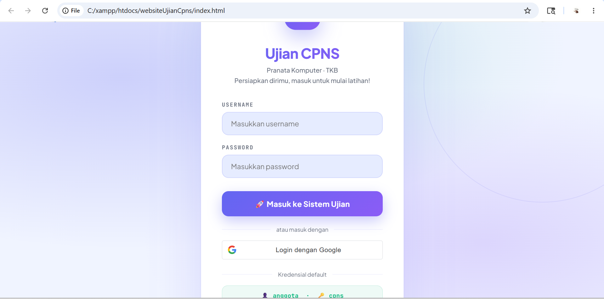
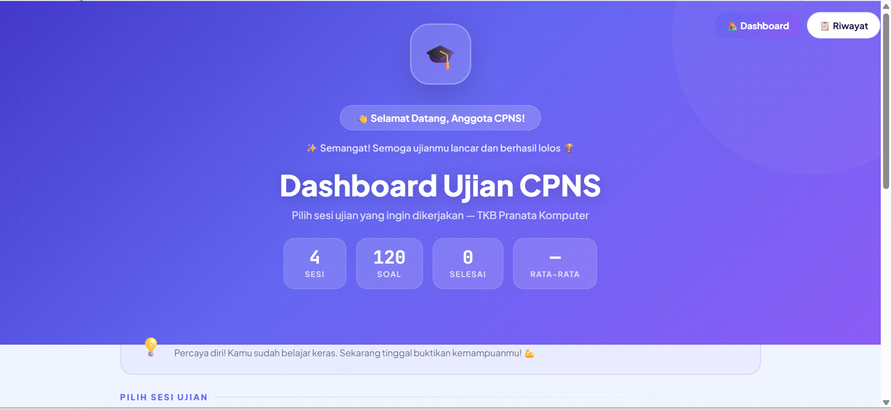
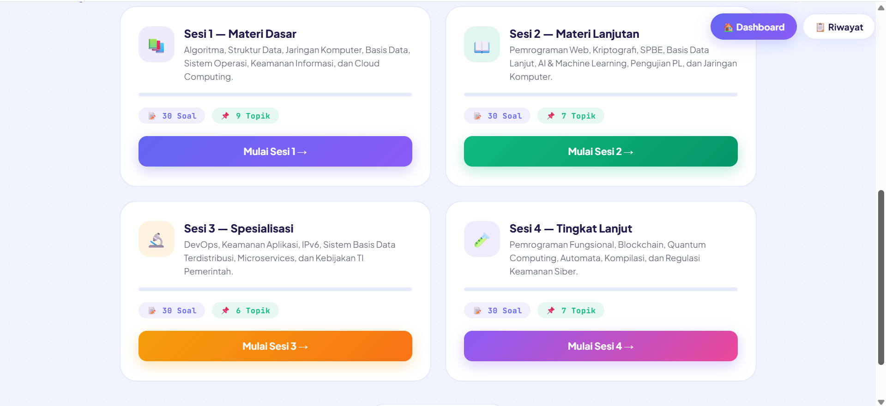
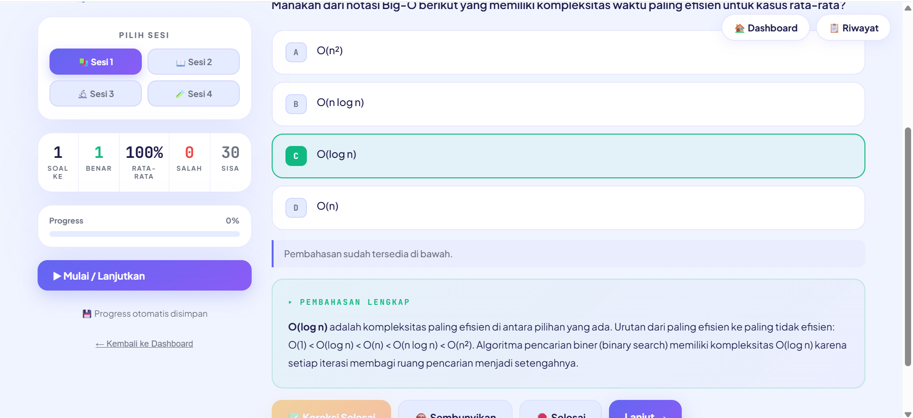
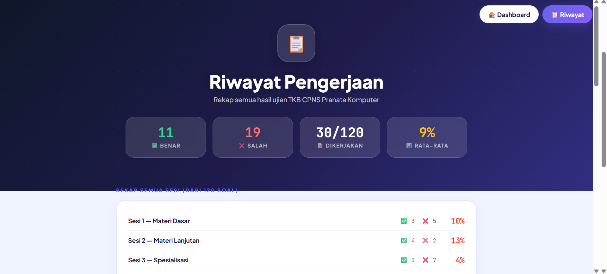

# 🚀 CATara — Platform Simulasi CAT CPNS Modern

CATara merupakan aplikasi simulasi ujian CAT CPNS berbasis web yang dirancang untuk membantu peserta mempersiapkan diri menghadapi seleksi ASN, khususnya pada bidang TKB Pranata Komputer. Website ini menghadirkan pengalaman ujian yang modern, interaktif, dan menyerupai sistem Computer Assisted Test (CAT) resmi.

Aplikasi ini menyediakan fitur latihan soal, pembahasan jawaban, statistik pengerjaan, progress ujian, hingga riwayat hasil pengerjaan peserta. Dengan tampilan UI modern dan responsif, CATara diharapkan mampu memberikan pengalaman belajar yang nyaman, efektif, dan mudah diakses kapan saja.

Selain sebagai media pembelajaran, CATara juga dikembangkan untuk melatih ketepatan, kecepatan, dan kemampuan analisis peserta dalam menjawab soal-soal CPNS berbasis komputer. Sistem ini dibuat dengan pendekatan antarmuka yang sederhana namun profesional agar pengguna dapat fokus saat mengerjakan latihan ujian.

---

# ✨ Fitur Utama

- 🔐 Sistem Login Pengguna
- 📚 Pembagian Sesi Ujian Berdasarkan Materi
- 📝 Simulasi Ujian CAT Interaktif
- 📊 Statistik Nilai dan Progress
- 📖 Pembahasan Jawaban Otomatis
- 💾 Penyimpanan Riwayat Pengerjaan
- 🎨 Tampilan Modern dan Responsif
- ⚡ Navigasi Soal Cepat dan Interaktif
- 📱 Mendukung Tampilan Mobile dan Desktop
- 🧠 Materi TKB Pranata Komputer Lengkap
- 🚀 Pengalaman Ujian Mirip Sistem CAT Resmi

---

# 🎯 Materi Ujian

Beberapa materi yang tersedia dalam simulasi ujian CATara antara lain:

- Algoritma dan Struktur Data
- Basis Data
- Jaringan Komputer
- Sistem Operasi
- Keamanan Informasi
- Cloud Computing
- Pemrograman Web
- Artificial Intelligence & Machine Learning
- DevOps dan Microservices
- Blockchain dan Quantum Computing
- Regulasi Keamanan Siber
- Dan materi TKB Pranata Komputer lainnya

---

# 📸 Preview Aplikasi

### 🔐 Halaman Login
Halaman autentikasi pengguna untuk masuk ke sistem simulasi CAT CPNS. Pengguna dapat login menggunakan username dan password sebelum memulai latihan ujian.

---

### 🏠 Dashboard Utama
Dashboard utama menampilkan informasi umum mengenai sesi ujian, jumlah soal, progress pengerjaan, serta navigasi menuju fitur utama aplikasi.

---

### 📚 Halaman Pilihan Sesi Ujian
Pengguna dapat memilih sesi ujian berdasarkan kategori materi TKB Pranata Komputer seperti algoritma, basis data, jaringan komputer, keamanan informasi, hingga cloud computing.

---

### 📝 Halaman Simulasi Ujian
Halaman pengerjaan soal dirancang menyerupai sistem CAT asli dengan fitur progress soal, pilihan jawaban interaktif, pembahasan otomatis, dan navigasi soal yang mudah digunakan.

---

### 📊 Halaman Riwayat Pengerjaan
Menampilkan hasil pengerjaan pengguna secara lengkap, termasuk jumlah jawaban benar, salah, total soal yang dikerjakan, serta persentase nilai akhir.

---

# 🛠️ Teknologi yang Digunakan

Frontend:
- HTML5
- CSS3
- JavaScript

Tools & Konsep:
- Local Storage
- Responsive UI Design
- Modern Gradient Interface
- Interactive User Experience

---

# 🎯 Tujuan Pengembangan

Website ini dikembangkan sebagai media latihan dan simulasi ujian CPNS berbasis CAT agar pengguna dapat meningkatkan kemampuan serta membiasakan diri dengan sistem ujian digital secara mandiri.

Selain itu, proyek ini juga dibuat sebagai implementasi pengembangan website interaktif modern dengan fokus pada pengalaman pengguna (UI/UX) dan simulasi sistem ujian online.

---

# 🌟 Keunggulan CATara

- Interface modern dan elegan
- User experience yang nyaman
- Simulasi ujian terasa realistis
- Tampilan clean dan profesional
- Mudah digunakan oleh semua pengguna
- Membantu latihan CPNS secara mandiri
- Dapat dikembangkan menjadi platform e-learning

---

# 📌 Status Project

✅ Project Development Completed  
🚧 Masih dapat dikembangkan untuk fitur:
- Timer ujian real-time
- Leaderboard peserta
- Randomisasi soal otomatis
- Sistem akun database
- Export hasil ujian PDF
- Dashboard admin

---

# 👨‍💻 Developer

Dikembangkan oleh:

## **Salwa Indriyani**
Mahasiswa & Frontend Web Developer

💜 *CATara — Belajar, Berlatih, dan Siap Menjadi ASN Indonesia.*
